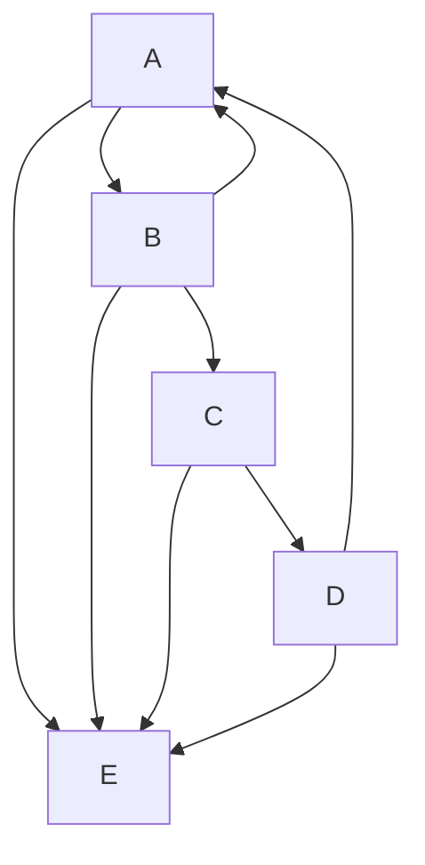

#markdown #cheetsheet #tutorial/obsidian
# Hallo This My Page
Lorem ipsum dolor sit amet
 😎👏🙌
## Heading 2
Lorem ipsum dolor sit amet
### Heading 3
Lorem ipsum dolor sit amet, 
#### Heading 4
Lorem ipsum dolor sit amet, consectetur adipiscing elit, sed do eiusmod tempor incididunt ut labore et dolore magna aliqua. 
##### Heading 5
Lorem ipsum dolor sit amet, consectetur adipiscing elit
###### Heading 6
Duis aute irure dolor in reprehenderit in voluptate velit esse cillum dolore eu fugiat nulla pariatur. Excepteur sint occaecat cupidatat non proident, sunt in culpa qui officia deserunt mollit anim id est laborum.
<h3 align="center"> Center Heading </h3>

Heading 1  
=


Heading 2  
--

```
Script Code
```


### Bold  
**The quick brown fox jumps over the lazy dog.**  
__The quick brown fox jumps over the lazy dog.__  
<strong>The quick brown fox jumps over the lazy dog.</strong>  
### Italic  
*The quick brown fox jumps over the lazy dog.*  
_The quick brown fox jumps over the lazy dog._
<em>The quick brown fox jumps over the lazy dog.</em>
### Bold and Italic  
**_The quick brown fox jumps over the lazy dog._**  
<strong><em>The quick brown fox jumps over the lazy dog.</em></strong>

Monospaced  
<samp>The quick brown fox jumps over the lazy dog.</samp>  
  
Underlined  
<ins>The quick brown fox jumps over the lazy dog.</ins>  
  
Strike-through  
~~The quick brown fox jumps over the lazy dog.~~

<table><tr><td>The quick brown fox jumps over the lazy dog.</td></tr></table>

|No|Table|
|--|--|
|1|Content 1|
|2| Content 3|
|1|Content 1|
|2| Content 3|

^fca664


This is
> a block &ens quote
>
> > Nested
> > Blockquote

	tab
		nested tab

^1c3fa2

* Item *
* Item *
    * item *
    * item *
- item -
+ Item +
+ Item +


1. Item 1
2. Item 2
    a. item 3a
    b. item 3b

X <sub>1</sub>  =  -2 <sup>53-1</sup>
Subscript <sub>The quick brown fox jumps over the lazy dog.</sub>  
Superscript <sup>The quick brown fox jumps over the lazy dog.</sup>

<kbd>cmd + shift + p</kbd>

[[Markdown Obsidian Sample#^fca664|table]]
[[Catatan Pertama | alias]]
[[Markdown Obsidian Sample#Heading 1]]

A class method is an <mark> instance method </mark> of the ==class object.== When a new class is created, an object of type `Class` is initialized and assigned to a global constant (Mobile in this case).

> [!info]
> This is Callout Info

> [!help]

> [!tip]
> Aliases: `hint`, `important`

>[!Note] Catatan

> [!faq]- Are callouts foldable? 
> Yes! In a foldable callout, the contents are hidden when the callout is collapsed.
> > Aliases: `help`, `faq`

> [!abstract]
> Lorem ipsum dolor sit amet
> > [!summary]

> [!tldr]

> [!success] 
> Aliases: `check`, `done`

> [!warning]
> Aliases: `caution`, `attention`

> [!failure]
> Aliases: `fail`, `missing`

> [!danger]
> Alias: `error`

> [!example]

> [!quote]
> Alias: `cite`

### Footnotes
This a footnote[^1]
This an another footnote^[[[Markdown Obsidian Sample#^1c3fa2 | random]]]

[^1]: Definition of footnote

---
embed link

![[Catatan Pertama]]

***

[link](google.com)
[google]: http://google.com
<http://google.com>




$$  
x = {-b \pm \sqrt{b^2-4ac} \over 2a}  
$$